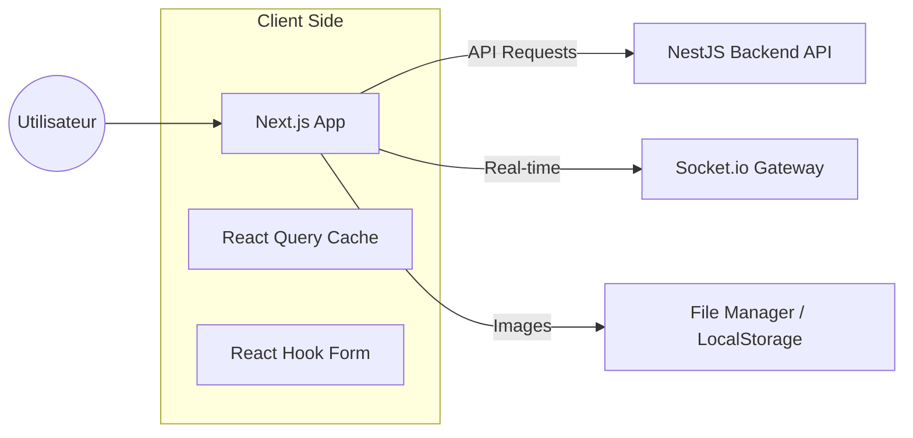

# SaaS Marketplace Frontend 🎨

## Introduction
Le frontend de **SaaS Marketplace** est une application web moderne, performante et hautement interactive. Elle offre une expérience utilisateur fluide pour la gestion des services, des annonces et de la messagerie, avec une attention particulière portée au design et à l'ergonomie (Dark Mode, Glassmorphism).

## Fonctionnalités Clés
- 📊 **Tableau de Bord Dynamique** : Vue d'ensemble des services, annonces et revenus.
- 💬 **Interface de Chat Premium** : Messagerie temps réel avec notifications, support audio et fichiers.
- 🛠️ **Gestion des Services** : Création et édition de services avec géolocalisation.
- 📣 **Espace Annonces** : Publication et consultation de petites annonces avec filtres.
- 📱 **Mobile First** : Interface entièrement responsive avec des composants adaptés au tactile.
- 🔍 **Recherche Intelligente** : Barres de recherche avec feedback immédiat.
- ⚙️ **Gestion de Compte** : Onboarding personnalisé (Akwaba), profil et abonnements.
- 🌗 **Thématisation** : Support natif du mode sombre et clair avec transition douce.

## Stack Technique
- **Framework** : [Next.js](https://nextjs.org/) (v16) avec App Router
- **Langage** : TypeScript
- **Styling** : [Tailwind CSS](https://tailwindcss.com/) (v4)
- **Animations** : [Framer Motion](https://www.framer.com/motion/)
- **Gestion d'État** : [TanStack Query](https://tanstack.com/query/latest) (React Query)
- **Formulaires** : React Hook Form + Zod (Validation)
- **Composants UI** : [Shadcn UI](https://ui.shadcn.com/) & Radix UI
- **Icônes** : Iconify & Lucide React
- **Temps Réel** : Socket.io Client

## Architecture Flow


## Installation et Démarrage
1. **Cloner le projet**
2. **Installer les dépendances** :
   ```bash
   npm install
   ```
3. **Configurer l'environnement** :
   Créer un fichier `.env.local` et définir `NEXT_PUBLIC_API_URL` et `NEXT_PUBLIC_SOCKET_URL`.
4. **Lancer le serveur de développement** :
   ```bash
   npm run dev
   ```
5. **Accéder à l'application** :
   `http://localhost:3000`

## Gouvernance et Sécurité
- **Auth Flow** : Persistance des jetons JWT via cookies ou LocalStorage.
- **Route Guards** : Middleware de protection des pages privées.
- **Validation** : Schémas Zod pour une validation robuste côté client avant envoi à l'API.

## Status Codes & Gestion des Erreurs
Le frontend consomme les données standardisées du backend (`BaseResponse`) :
- **Loading States** : Skeletons et spinners intégrés pour chaque action asynchrone.
- **Notifications** : Utilisation de `Sonner` pour les retours visuels (Succès/Erreur).
- **Fallback** : Gestion des erreurs 404 et des états vides ("Empty States").

---
*Une interface conçue pou la performance et l'élégance.*
