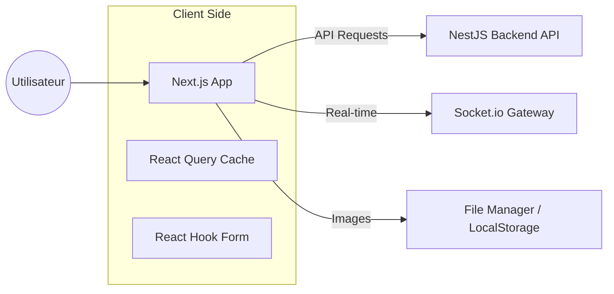

# Djamko 🎨

## Introduction
Le frontend de **Djamko** est une application web moderne, performante et hautement interactive. Elle offre une expérience utilisateur fluide pour la gestion des services, des annonces et de la messagerie, avec une attention particulière portée au design et à l'ergonomie (Dark Mode, Glassmorphism).

## Fonctionnalités Clés
- 📊 **Tableau de Bord Dynamique** : Vue d'ensemble des services, annonces et revenus.
- 💬 **Interface de Chat Premium** : Messagerie temps réel avec notifications, support audio et fichiers.
- 🛠️ **Gestion des Services** : Création et édition de services avec géolocalisation.
- 📣 **Espace Annonces** : Publication et consultation de petites annonces avec filtres.
- 📱 **Mobile First** : Interface entièrement responsive avec des composants adaptés au tactile.
- 🔍 **Recherche Intelligente** : Barres de recherche avec feedback immédiat.
- ⚙️ **Gestion de Compte** : Onboarding personnalisé (Akwaba), profil et abonnements.
- 🌗 **Thématisation** : Support natif du mode sombre et clair avec transition douce.

## Stack Technique
- **Framework** : [Next.js](https://nextjs.org/) (v16) avec App Router
- **Langage** : TypeScript
- **Styling** : [Tailwind CSS](https://tailwindcss.com/) (v4)
- **Animations** : [Framer Motion](https://www.framer.com/motion/)
- **Gestion d'État** : [TanStack Query](https://tanstack.com/query/latest) (React Query)
- **Formulaires** : React Hook Form + Zod (Validation)
- **Composants UI** : [Shadcn UI](https://ui.shadcn.com/) & Radix UI
- **Icônes** : Iconify & Lucide React
- **Temps Réel** : Socket.io Client

## Architecture Flow

```mermaid
graph LR
    User((Utilisateur)) --> NextJS[Next.js App]
    NextJS -->|API Requests| Backend[NestJS Backend API]
    NextJS -->|Real-time| Socket[Socket.io Gateway]
    NextJS -->|Images| Storage[File Manager / LocalStorage]
    subgraph "Client Side"
        NextJS
        RQ[React Query Cache]
        RHF[React Hook Form]
    end
```

## Installation et Démarrage
1. **Cloner le projet**
2. **Installer les dépendances** :
   ```bash
   npm install
   ```
3. **Configurer l'environnement** :
   Créer un fichier `.env.local` et définir `NEXT_PUBLIC_API_URL` et `NEXT_PUBLIC_SOCKET_URL`.
4. **Lancer le serveur de développement** :
   ```bash
   npm run dev
   ```
5. **Accéder à l'application** :
   `http://localhost:3000`

## Gouvernance et Sécurité
- **Auth Flow** : Persistance des jetons JWT via cookies ou LocalStorage.
- **Route Guards** : Middleware de protection des pages privées.
- **Validation** : Schémas Zod pour une validation robuste côté client avant envoi à l'API.

## Status Codes & Gestion des Erreurs
Le frontend consomme les données standardisées du backend (`BaseResponse`) :
- **Loading States** : Skeletons et spinners intégrés pour chaque action asynchrone.
- **Notifications** : Utilisation de `Sonner` pour les retours visuels (Succès/Erreur).
- **Fallback** : Gestion des erreurs 404 et des états vides ("Empty States").

---

## Variables d'Environnement Complètes

Créer un fichier `.env.local` à la racine :

```env
# API Backend
NEXT_PUBLIC_BASE_URL=http://localhost:4000

# WebSocket
NEXT_PUBLIC_SOCKET_URL=http://localhost:4000

# Firebase (Notifications Push)
NEXT_PUBLIC_FIREBASE_API_KEY=
NEXT_PUBLIC_FIREBASE_AUTH_DOMAIN=
NEXT_PUBLIC_FIREBASE_PROJECT_ID=
NEXT_PUBLIC_FIREBASE_STORAGE_BUCKET=
NEXT_PUBLIC_FIREBASE_MESSAGING_SENDER_ID=
NEXT_PUBLIC_FIREBASE_APP_ID=
NEXT_PUBLIC_FIREBASE_VAPID_KEY=
```

---

## Routes — Public vs Protégé

### Pages Publiques (sans authentification)
| Route                        | Description                            |
|------------------------------|----------------------------------------|
| `/`                          | Homepage avec slider et présentation   |
| `/login`                     | Connexion                              |
| `/register`                  | Inscription                            |
| `/solutions`                 | Page des fonctionnalités               |
| `/pricing`                   | Plans et tarifs                        |
| `/privacy-policy`            | Politique de confidentialité           |
| `/terms-of-use`              | Conditions d'utilisation               |
| `/cookies`                   | Politique cookies                      |
| `/shop/[storeName]`          | Boutique publique d'un vendeur         |
| `/logistics/[companyName]`   | Profil public d'une entreprise logist. |
| `/services/[id]`             | Détail d'un service                    |

### Pages Protégées (JWT requis)
| Route                        | Description                            |
|------------------------------|----------------------------------------|
| `/akwaba`                    | Onboarding utilisateur                 |
| `/chat-ia`                   | Interface chat IA                      |
| `/location`                  | Paramètres de localisation             |
| `/logs`                      | Historique d'activité                  |
| `/connect/[id]`              | Connexion service                      |
| `/services`                  | Gestion des services                   |
| `/admin/*`                   | Espace admin (rôle ADMIN requis)       |

---

## Messagerie Temps Réel

Le chat utilise Socket.io (SocketProvider) pour les mises à jour instantanées :

```typescript
// Connexion automatique si authentifié
// Écoute des événements :
socket.on('new_message', (message) => { ... })
socket.on('notification', (notif) => { ... })
socket.on('delivery_update', (update) => { ... })
```

Le hook `useRealTimeUpdate` gère la synchronisation automatique des données en temps réel avec le cache React Query.

---

## Module EasyDelivery (Frontend)

Le composant de tracking live se trouve dans `components/delivery/`.
Il affiche :
- Position du livreur sur carte Leaflet en temps réel
- Statut de la livraison avec timeline
- Informations livreur (nom, téléphone, véhicule)
- Temps estimé d'arrivée

---

*Une interface conçue pour la performance et l'élégance.*
